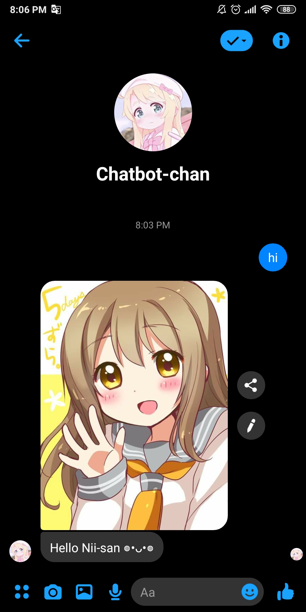
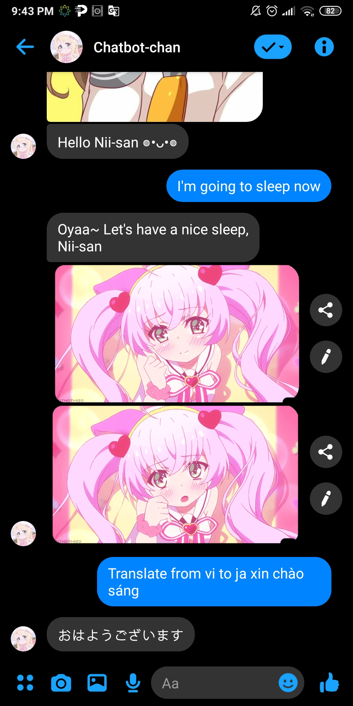
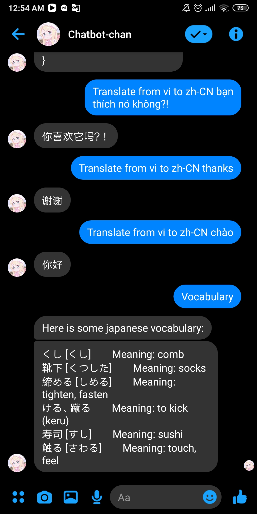
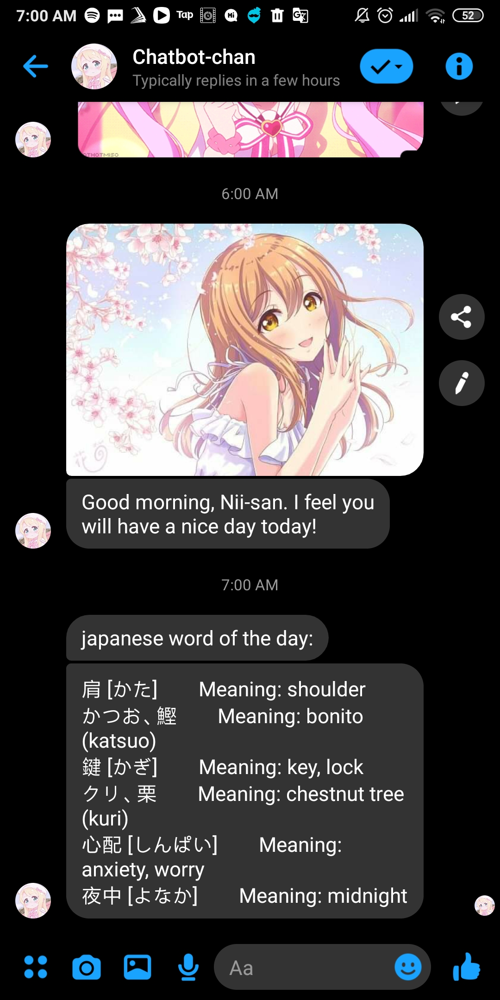

# Facebook Messenger chatbot nodeJS
 
Extract the node_modules.rar 
# init:
 
`npm init` 
`npm install` 
`npm install --save express` 
`npm install --save request` 
`npm install --save body-parser` 
`npm i yandex-translate` 
`npm i cheerio` 

# heroku deployment: 
run heroku file or heroku.bat

# showcase:

Translate text via Yandex Translate feat <a href="https://www.npmjs.com/package/yandex-translate">yandex-translate</a>

Daily Japanese Vocabulary vie <a href="https://www.bestrandoms.com/random-japanese-words ">bestrandoms</a> 

