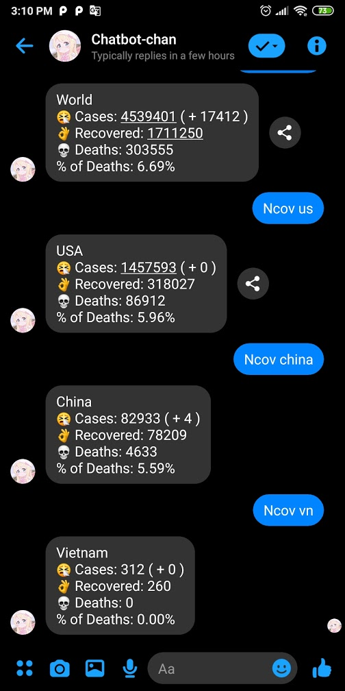

# Facebook Messenger chatbot nodeJS

<br>

# Usage:

```diff

- Extract the node_modules.rar to overwrite the node_modules

! or running these commands:

+ npm init
+ npm install
+ npm install --save express
+ npm install --save request
+ npm install --save body-parser
+ npm i cheerio
+ npm i yandex-translate

# Done

```

# heroku deployment:<br>
run heroku file or heroku.bat <br>
keep heroku app awake <a href="https://pingability.com/">pingability</a> <br>
<a href="https://www.statuscake.com">StatusCake</a> <br>

# showcase:
<br><br>
<br><br>
# <br>Translate text via Yandex Translate feat <a href="https://www.npmjs.com/package/yandex-translate">yandex-translate</a><br>
<br><br>
# <br>Daily Japanese Vocabulary vie <a href="https://www.bestrandoms.com/random-japanese-words">bestrandoms</a> <br>
<br><br>
# <br>Coronavirus Update <a href="https://corona.lmao.ninja/">corona.lmao.ninja</a> <br>
<br><br>
